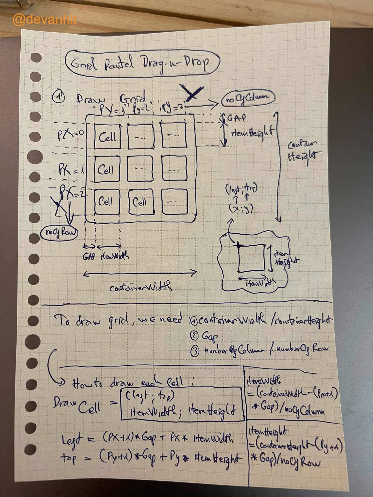
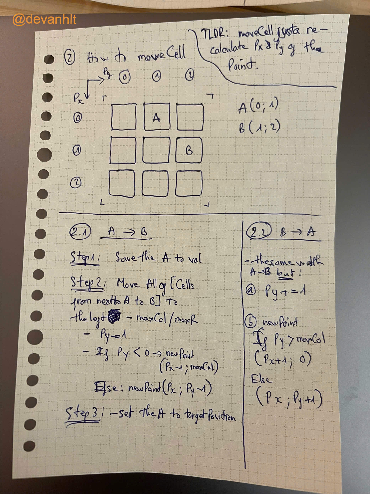

# PastelGrid

A React Native tablet application that allows users to create and customize beautiful pastel-colored grids. Users can configure grid parameters, select base colors, and rearrange grid items through an intuitive drag-and-drop interface.

# Result:

<video width="320" height="240" controls>
  <source src="assets/video.mp4" type="video/mp4">
  Your browser does not support the video tag.
</video>

## Key Features

- Interactive grid configuration
- Pastel color palette selection
- Drag-and-drop grid item rearrangement
- Tablet-optimized interface

## Setup and Installation

### Prerequisites

- Node.js (v18 or higher recommended)
- Yarn package manager
- Expo CLI (`npm install -g expo-cli`)
- iOS Simulator (for Mac users) or Android Emulator
- Expo Go app on your physical device (optional for testing)

### Installation Steps

1. Clone the repository:

   ```bash
   git clone https://github.com/devanhlt/grid_pastels_test.git
   cd grid_pastels_test
   ```

2. Install dependencies:

   ```bash
   yarn install
   ```

3. Start the development server:

   ```bash
   yarn start
   ```

4. Run on specific platforms:
   - iOS: `yarn ios`
   - Android: `yarn android`
   - Web: `yarn web`

## Technical Highlights

### 1. Modern React Native Stack

- Built with **Expo SDK 52** for streamlined development and deployment
- **TypeScript** integration for type safety and better development experience
- **React 18.3.1** with latest features and improvements

### 2. Animation and Gesture Handling

- Utilizes `react-native-reanimated` (v3.16.1) for high-performance grid animations
- Implements `react-native-gesture-handler` for smooth drag-and-drop interactions
- Safe area handling with `react-native-safe-area-context` for tablet layouts

### 3. Testing Infrastructure

- Comprehensive testing setup with **Jest** and **Testing Library**
- Includes both unit and integration testing capabilities
- Custom Jest configuration for React Native environment

### 4. Development Tools

- TypeScript configuration for strict type checking
- Babel configuration for modern JavaScript features
- ESLint and TypeScript type checking for code quality

## Testing

Run the test suite using:

```bash
yarn test
```

## Project Structure

```
PastelGrid/
├── src/           # Source code
├── assets/        # Static assets and color palettes
├── App.tsx        # Main application component
├── index.ts       # Entry point
└── tests/         # Test files
```

## How to Draw and Move?

# Drawing the Grid



# Moving Cells



# Technical Implementation

# The drag and drop system uses:

- `PanGestureHandler` from `react-native-gesture-handler` to detect gestures and handle touch interactions
- `react-native-reanimated` for smooth and performant animations, enabling seamless cell movement

## License

This project is licensed under the MIT License.
